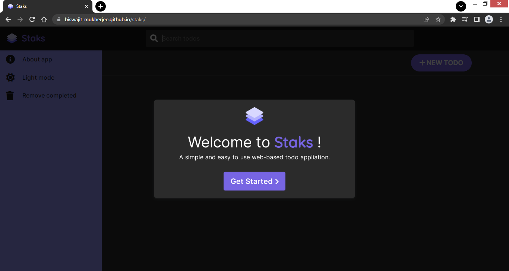
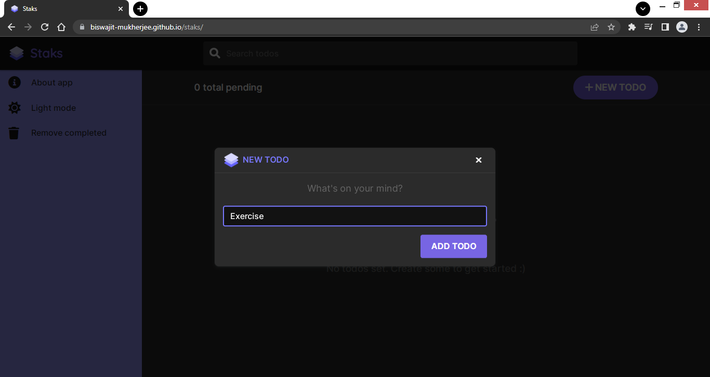
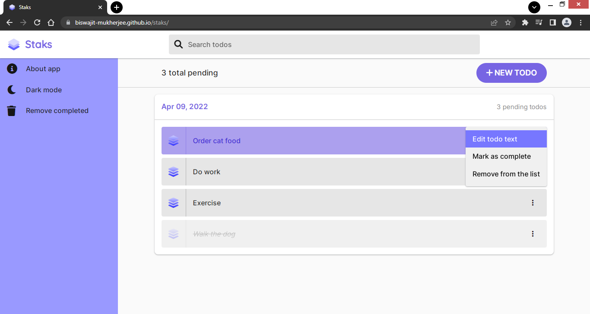

# Staks

A simple and easy to use web-based todo appliation.

## Acknowledgements

 - [Google Chrome History tab](chrome://history/)
 - [Google Chrome Downloads tab](chrome://downloads/)
 - [Logo](https://iconscout.com/icon/layer-1957315)
 - [Icons](https://fontawesome.com/icons)
 - [UUID library](https://github.com/uuidjs/uuid)
 
 

## Authors

- [@biswajitmukherjee](https://github.com/Biswajit-Mukherjee)

## Installation

No installation required. It is a web based applictaion.

    
## License

&copy; Biswajit Mukherjee

<!--  -->

## Screenshots

Dark mode

Light mode

## Tech Stack

**Client:** HTML5, CSS3, Javascript ES6, Web Storage API

**Server:** Github Pages

## Support

For support, email biswajitmukherjee549@gmail.com.

## Lessons Learned

- Implementing responsive web layouts using HTML & CSS
- Adding user interactions using Javascript
- Integrating app with backend using broswer localStorage
- Solving real world problems using Data Structures
- Implementing Dark mode
- Integrating app with third-party libraries

